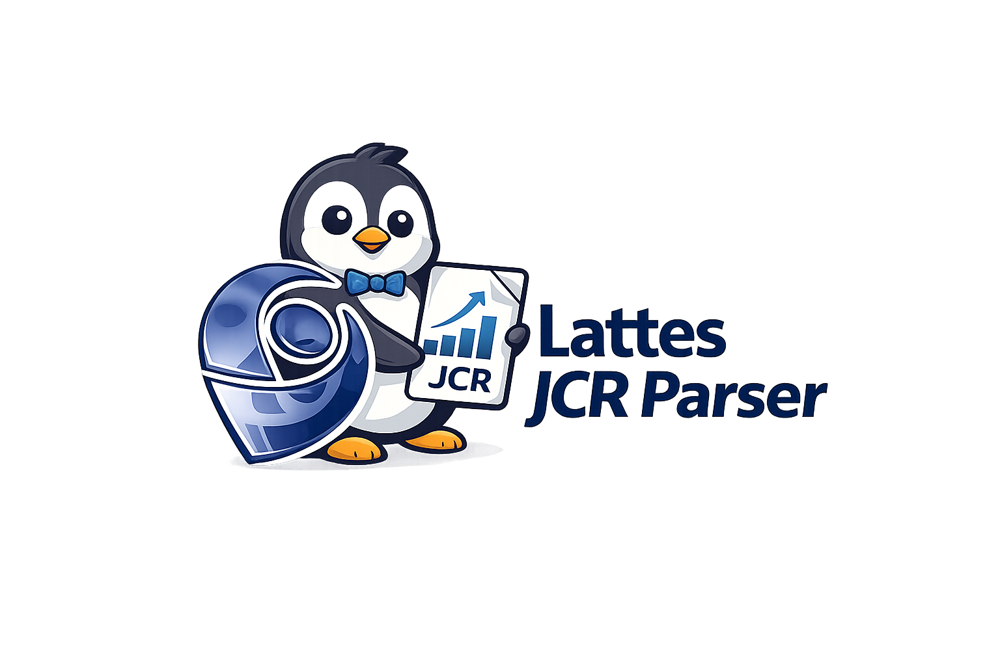

  

# Lattes JCR Parser

Ferramenta web para extração, organização e análise do fator de impacto (JCR) a partir do [Currículo Lattes](https://lattes.cnpq.br/) salvo em formato HTML **completo**.

Autor: Andre Belem [andrebelem@id.uff.br](mailto:andrebelem@id.uff.br) (em parceria com a [F.R.I.D.A.Y.](https://observatoriooceanografico.org/equipe/friday-bot/))

---

## Motivação

Apesar disso, não existe uma ferramenta oficial ou padronizada que permita extrair automaticamente, a partir do Currículo Lattes, os valores de JCR associados aos artigos publicados, tampouco realizar somatórios ou análises temporais de forma transparente e reproduzível.

Este projeto surgiu para preencher essa lacuna, oferecendo uma solução simples, auditável e totalmente executada no navegador do usuário.

---

## O que é o JCR

O Journal Citation Reports (JCR) é um indicador bibliométrico publicado pela Clarivate Analytics que expressa, de forma resumida, o impacto médio dos artigos publicados em um periódico científico em um determinado ano.

Embora o JCR não seja um indicador absoluto de qualidade individual de artigos ou pesquisadores, ele é amplamente utilizado como critério auxiliar em avaliações acadêmicas, editais e relatórios institucionais.

## Como o programa funciona

O *Lattes JCR Parser* opera exclusivamente em ambiente *client-side*, escrito em JavaScript, o que significa que todo o processamento ocorre localmente no navegador do usuário.

Nenhum dado é enviado, armazenado ou transmitido para servidores externos. Nenhuma informação é gravada ou compartilhada.

Para que o aplicativo funcione corretamente, é necessário que o navegador permita a execução de JavaScript. Caso o JavaScript esteja desabilitado por configurações de segurança, extensões de bloqueio ou políticas institucionais, o processamento não será executado.

O funcionamento básico consiste em:

1. O usuário faz o upload do arquivo HTML **completo** do Currículo Lattes  
2. O programa analisa a estrutura do HTML  
3. São identificados os artigos completos publicados em periódicos  
4. Quando disponível, o fator de impacto JCR é extraído a partir do ícone “jcr” presente no próprio HTML do Lattes  
5. Os dados são organizados em uma tabela contendo:
   - Ano
   - Referência completa
   - Ano do JCR
   - Valor do JCR
6. O usuário pode definir um intervalo de anos e calcular:
   - Número de artigos no período
   - Número de artigos com JCR
   - Soma total do JCR
   - Média do JCR no intervalo selecionado
7. Todos os dados podem ser exportados para Excel

## Requisitos fundamentais

### Arquivo HTML completo e navegador recomendado

É absolutamente essencial que o Currículo Lattes seja salvo como HTML completo, incluindo todos os arquivos associados ! Arquivos no formato `.mhtml` não são suportados. O Google Chrome não gera corretamente um HTML completo compatível com este parser. Por isso, recomenda-se fortemente o uso do [Mozilla Firefox](https://www.firefox.com/pt-BR/), seguindo os passos:

1. Acesse o Currículo Lattes  
2. Clique com o botão direito na página  
3. Selecione “Salvar página como”  
4. Escolha a opção **“Página completa”**  
5. Salve o arquivo `.html` e a pasta associada

## Sobre inconsistências nos resultados

Caso algum artigo não apresente valor de JCR ou apareça com informações incompletas, recomenda-se verificar primeiramente:

- Se o lançamento do artigo no Currículo Lattes está correto  
- Se o periódico possui JCR no ano correspondente  
- Se o ícone “jcr” aparece ao lado da publicação na visualização online do Lattes  

O programa apenas extrai informações que já estão presentes no HTML gerado pelo próprio sistema Lattes.

## Escopo e limitações

O somatório de JCR não constitui um indicador bibliométrico oficial. Os resultados devem ser utilizados de forma exploratória, comparativa ou para organização interna. A ferramenta não substitui análises qualitativas da produção científica.

Porém, o gráfico de JCR acumulado ao longo do tempo tem caráter auxiliar e exploratório, sendo particularmente útil para visualizar tendências e a rampa de crescimento da produção associada a periódicos com fator de impacto registrado. Ainda assim, não deve ser interpretado como métrica formal de avaliação.

## Desenvolvimento contínuo

Este é um projeto em constante desenvolvimento. Novas funcionalidades, melhorias no parser e refinamentos na análise poderão ser incorporados progressivamente, mantendo sempre os princípios de transparência, simplicidade e execução local (embora penso que esta deveria ser uma ferramenta incorporada do próprio Lattes).

Contribuições, sugestões e testes são bem-vindos por meio do repositório no GitHub (https://github.com/andrebelem/lattes-jcr-parser).  
Se você considerou este aplicativo útil, a divulgação, a citação do projeto e o apoio voluntário via https://buymeacoffee.com/andrebelem são apreciados.
